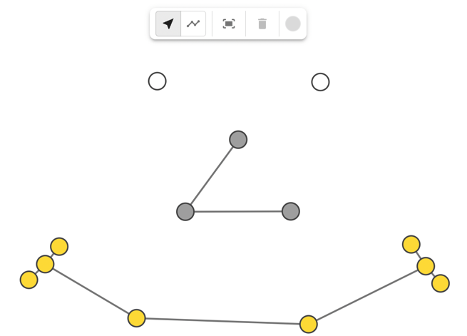

# Graph Editor

An interactive browser-based tool for drawing and exploring graphs.

Place nodes on a canvas, connect them with edges, and rearrange them freely. Supports both mouse and touch input, including pinch-to-zoom on mobile.

## Features

- Add nodes by clicking empty space
- Connect nodes with edges using line-drawing mode (click or drag between nodes)
- Move nodes by dragging
- Delete selected nodes or edges
- Pan and zoom the canvas
- Color-code nodes with a built-in color picker
